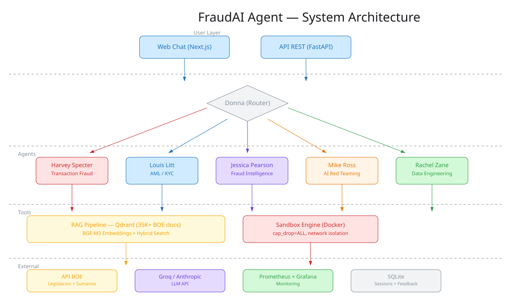

<p align="center">
  
</p>

<h1 align="center">FraudAI Agent</h1>

<p align="center">
  <strong>AI-powered multi-agent platform for banking fraud detection and AI red teaming in FinTech</strong>
</p>

<p align="center">
  
  
  
  
  
  
  
  
</p>

---

## What is FraudAI Agent?

A Level 3 agentic AI platform (advisory + analysis + **execution**) that simulates a fraud investigation law firm. Six specialized AI agents — inspired by the characters of *Suits* — collaborate to detect fraud, ensure regulatory compliance, investigate criminal networks, and red-team AI systems.

Unlike simple LLM wrappers, FraudAI agents **execute real tools**: analyze transaction datasets, generate compliance reports, build fraud network graphs, and run adversarial attacks against ML models — all inside sandboxed Docker containers.

### Agents

| Agent | Role | Personality |
|-------|------|-------------|
| **Donna Paulsen** | Router | Classifies intent, routes to the right specialist |
| **Harvey Specter** | Transaction Fraud Detection | Direct, confident. Analyzes transactions, detects anomalies, scores risk |
| **Louis Litt** | AML / KYC / Compliance | Meticulous. Cites exact legal articles, generates SAR reports |
| **Jessica Pearson** | Fraud Intelligence | Strategic. Network graph analysis, identity resolution |
| **Mike Ross** | AI Red Teaming | Creative. Adversarial attacks, prompt injection testing |
| **Rachel Zane** | Data Engineering | Rigorous. ETL pipelines, feature engineering, data quality |

---

## Architecture

<p align="center">
  
</p>

**Key components:**
- **LangGraph StateGraph** orchestrates agent routing with conversational continuity
- **RAG pipeline** with 35K+ Spanish legal documents from the BOE (Official State Gazette)
- **Qdrant** vector database with hybrid search (dense BGE-M3 + sparse BM25)
- **Sandboxed execution** via ephemeral Docker containers (cap_drop=ALL, network isolation)
- **Groq/Anthropic LLM** with multi-provider support and 3-tier routing fallback
- **JWT authentication** with RBAC per tier (Free/Pro/Enterprise)
- **Prometheus + Grafana** monitoring with 23 alert rules

---

## Tech Stack

| Layer | Technology |
|-------|-----------|
| **LLM Orchestration** | LangGraph, LangChain |
| **LLM Providers** | Groq, Anthropic Claude, Ollama (local) |
| **Vector DB** | Qdrant (hybrid search) |
| **Embeddings** | BGE-M3 (1024-dim, multilingual) |
| **Backend** | FastAPI, Python 3.11+ |
| **Frontend** | Next.js 14, React, Tailwind CSS |
| **Auth** | JWT (PyJWT) with OAuth2 |
| **Sandbox** | Docker containers with seccomp |
| **Monitoring** | Prometheus, Grafana |
| **CI/CD** | GitHub Actions (lint, typecheck, test, docker, security) |
| **Database** | SQLite (sessions/feedback), Qdrant (vectors) |

---

## Quick Start

### Prerequisites
- Docker + Docker Compose
- Python 3.11+
- Node.js 20+ with pnpm
- A Groq API key ([get one free](https://console.groq.com))

### 1. Clone and configure

```bash
git clone https://github.com/adrianinfantes/FraudAI-Agent.git
cd FraudAI-Agent
cp .env.example .env
# Edit .env and add your GROQ_API_KEY
```

### 2. Start infrastructure

```bash
docker compose up -d  # Qdrant + Ollama
```

### 3. Install and run backend

```bash
uv sync --dev
uv run python -m uvicorn fraudai.api.app:create_app --factory --host 0.0.0.0 --port 8000
```

### 4. Install and run frontend

```bash
cd frontend && pnpm install && pnpm dev
```

### 5. Open the app

- **Chat UI**: http://localhost:3000
- **API Docs**: http://localhost:8000/docs
- **Qdrant Dashboard**: http://localhost:6333/dashboard

### 6. (Optional) Index Spanish legal corpus

```bash
uv run python -m fraudai.ingestion --mode full
```

---

## Project Structure

```
src/fraudai/
  agents/          # 6 agent definitions, prompts, LangGraph orchestration
  api/             # FastAPI endpoints, auth, session management
  core/            # Config, database, metrics, tracing
  evaluation/      # RAGAS benchmark (50 questions, 5 categories)
  ingestion/       # BOE download pipeline, text extraction, chunking
  rag/             # Retriever, reranker, prompt templates
  tools/           # Sandbox engine, tool implementations

frontend/          # Next.js 14 chat UI with SSE streaming
monitoring/        # Prometheus alerts, Grafana dashboards
docs/              # ADRs, requirements, API reference, runbook
tests/             # 482 unit + 23 live smoke tests
```

---

## Documentation

| Document | Description |
|----------|-------------|
| [Requirements (F0)](docs/F0_requirements.md) | Business, user, system, and ML requirements |
| [Architecture Decisions (F0.5)](docs/F0.5_ADRs.md) | 6 ADRs: LLM strategy, vector DB, LangGraph, sandboxing, deployment |
| [Backlog (F0.5)](docs/F0.5_backlog.md) | 74 user stories, 8 sprints, MVP scope |
| [Technical Spec (F2)](docs/F2_spec.md) | Metrics, baselines, SLAs, fairness evaluation |
| [API Reference (F6)](docs/F6_api_reference.md) | All endpoints with curl examples |
| [Deployment Guide (F6)](docs/F6_deployment_guide.md) | Prerequisites, config, production deploy |
| [Operations Runbook (F6)](docs/F6_runbook.md) | Common issues, rollback, scaling |

---

## Testing

```bash
# Unit + integration tests (482 tests, 93% coverage)
uv run python -m pytest tests/ -q

# Live smoke tests (requires running backend)
./scripts/smoke-test.sh

# Coverage report
uv run python -m pytest tests/ --cov=fraudai --cov-report=html
```

---

## Key Design Decisions

- **Hybrid LLM routing**: Keywords (instant) -> Groq API (200ms) -> Ollama (fallback)
- **Conversational continuity**: Follow-up messages stay with the current agent
- **RAG with auto-filtering**: Mentions of specific laws trigger metadata filters
- **Security-first sandbox**: All code execution in Docker with dropped capabilities
- **HITL for red teaming**: Mike Ross requires explicit user approval before offensive actions

---

## Status

This is a **portfolio project** demonstrating AI agent architecture for FinTech fraud detection. It is functional and tested but not production-deployed.

**What works:**
- All 6 agents respond with domain expertise
- RAG with 35K+ BOE legal documents
- Conversational multi-turn sessions
- Agent routing and override
- JWT authentication
- SQLite persistence
- Prometheus metrics

---

## Author

**Adrian Infantes** — Senior AI Engineer specializing in FinTech, fraud detection, and AI red teaming.

- [LinkedIn](https://linkedin.com/in/adrianinfantes)
- [GitHub](https://github.com/adrianinfantes)

---

## License

MIT License. See [LICENSE](LICENSE).
